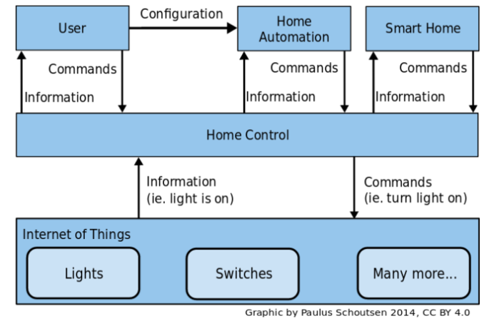
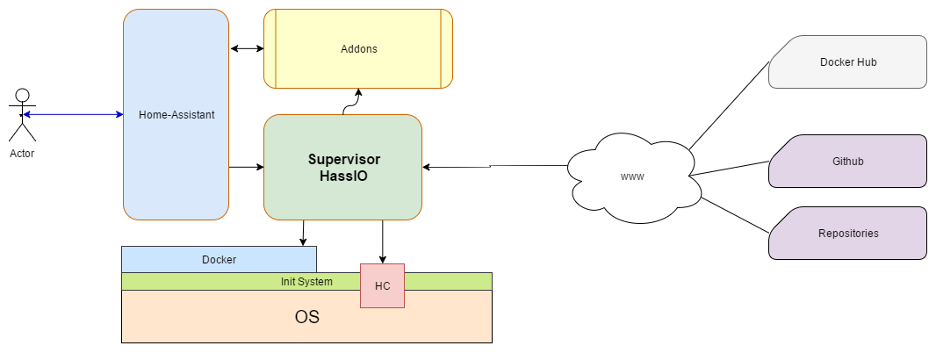
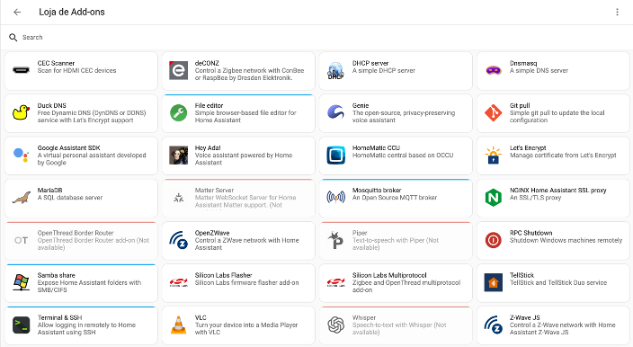
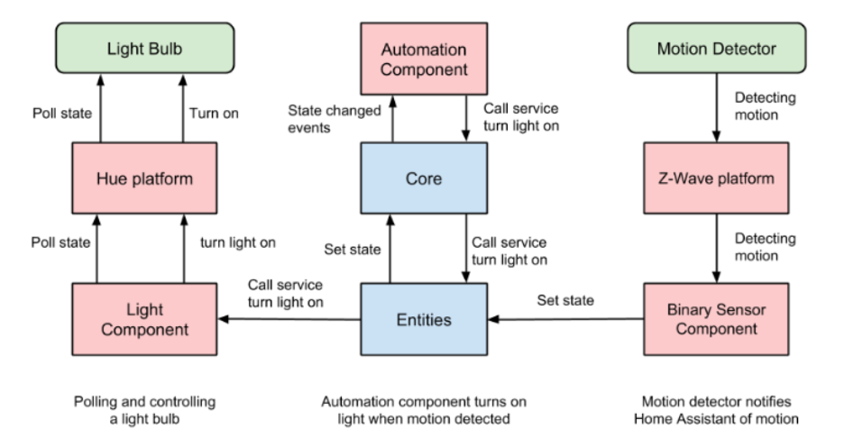
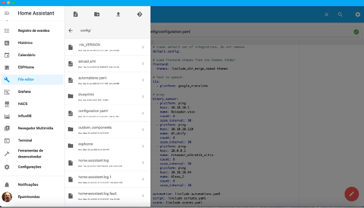

<td style="width: 20%;"></td>

<strong>Home Assistant </strong>

<strong>Prof Epaminondas Lage</strong>

<a href="http://lattes.cnpq.br/7787341723868111"> Currículo Lattes LAGE, E. S.</a> 

# Índice 

* [Introdução](#Introdução)
* [Home Assistant Operating System](#Home-Assistant-Operating-System)
* [Add-on no Home Assistant](#Add-on-no-Home-Assistant)
* [Módulos do Home Assitant](#Módulos-do-Home-Assistant)

# Introdução

O Home Assistant &eacute; uma plataforma de automa&ccedil;&atilde;o residencial descentralizada, gratuita e de c&oacute;digo aberto. Ele possibilita o controle de atuadores, interpreta&ccedil;&atilde;o de dados coletados por sensores, implementa&ccedil;&atilde;o de regras de automa&ccedil;&atilde;o e gerenciamento da comunica&ccedil;&atilde;o entre dispositivos. O Home Assistant pode ser executado em computadores Linux, em SBCs (Single Board Computers) com o sistema operacional dedicado Hass.io, ou em qualquer outro ambiente que possua Python e suas depend&ecirc;ncias instaladas.

Uma das vantagens distintas do Home Assistant &eacute; sua capacidade de rodar em SBCs (Single Board Computers), como o Raspberry Pi, aproveitando eficientemente os recursos de hardware dispon&iacute;veis. Isso permite uma implanta&ccedil;&atilde;o econ&ocirc;mica em dispositivos de baixo custo, tornando o Home Assistant uma escolha popular entre os entusiastas da automa&ccedil;&atilde;o residencial.

O Home Assistant oferece v&aacute;rias vantagens, como:

<ul>
	<li style="text-align:justify">Gratuito e de c&oacute;digo aberto</li>
	<li style="text-align:justify">Otimizado para rodar em SBCs</li>
	<li style="text-align:justify">Permite a implanta&ccedil;&atilde;o de automa&ccedil;&otilde;es localmente</li>
	<li style="text-align:justify">F&aacute;cil instala&ccedil;&atilde;o</li>
	<li style="text-align:justify">Possui uma interface web interativa para controle</li>
	<li style="text-align:justify">Oferece rollback para vers&otilde;es antigas</li>
	<li style="text-align:justify">&Eacute; escal&aacute;vel, permitindo trabalhar com add-ons</li>
</ul>

O Home Assistant &eacute; projetado para operar de forma aut&ocirc;noma e local, sem depender de uma conex&atilde;o cont&iacute;nua com a nuvem. Isso significa que todas as automa&ccedil;&otilde;es e regras s&atilde;o executadas diretamente no dispositivo, proporcionando maior privacidade, seguran&ccedil;a e desempenho. A instala&ccedil;&atilde;o do Home Assistant &eacute; simplificada e flex&iacute;vel, com op&ccedil;&otilde;es como o Hass.io, um sistema operacional otimizado para o Home Assistant, que facilita a configura&ccedil;&atilde;o e o gerenciamento do sistema.

# Home Assistant Operating System

Para facilitar a instala&ccedil;&atilde;o e utiliza&ccedil;&atilde;o do Home Assistant, foi desenvolvido o Hass.io, um sistema operacional customizado e configurado para executar o Home Assistant. O Home Assistant &eacute; gerenciado por um supervisor que roda dentro de um container Docker, o qual, por sua vez, &eacute; executado por um sistema operacional desenvolvido especificamente para SBCs. O supervisor possui uma API que gerencia os processos do Home Assistant e tamb&eacute;m &eacute; respons&aacute;vel por realizar atualiza&ccedil;&otilde;es do sistema.

O Home Assistant Operating System oferece um ambiente est&aacute;vel e seguro para executar o Home Assistant, garantindo uma experi&ecirc;ncia confi&aacute;vel para o usu&aacute;rio. Al&eacute;m disso, a integra&ccedil;&atilde;o do Docker simplifica a implanta&ccedil;&atilde;o e o gerenciamento do Home Assistant e de seus complementos, permitindo atualiza&ccedil;&otilde;es f&aacute;ceis e aprimoramentos cont&iacute;nuos do sistema.

Para instalar o Home Assistant Operating System, o usu&aacute;rio precisa baixar a imagem apropriada para seu dispositivo e plataforma no site oficial do Home Assistant. Essa imagem &eacute; ent&atilde;o gravada em um meio de armazenamento, como um cart&atilde;o SD ou um dispositivo USB, e inserida no dispositivo alvo. Ao inicializar, o dispositivo carrega o Home Assistant Operating System e inicia o processo de instala&ccedil;&atilde;o.

Uma vez instalado, o Home Assistant Operating System fornece uma interface de usu&aacute;rio baseada na web para configurar e personalizar a automa&ccedil;&atilde;o residencial. O Supervisor, uma parte integral do Home Assistant Operating System, gerencia o Home Assistant Core e os complementos, fornecendo uma camada adicional de facilidade de uso e controle.

O Home Assistant Operating System &eacute; o m&eacute;todo de instala&ccedil;&atilde;o recomendado para a maioria dos usu&aacute;rios. Trata-se de um sistema operacional Linux otimizado para hospedar o Home Assistant e seus complementos. O Home Assistant Operating System utiliza o Docker como motor de cont&ecirc;iner, o que proporciona uma execu&ccedil;&atilde;o eficiente e isolada do Home Assistant e de suas depend&ecirc;ncias.

Em resumo, o Home Assistant Operating System &eacute; a escolha recomendada para a instala&ccedil;&atilde;o do Home Assistant, proporcionando um ambiente otimizado, seguro e de f&aacute;cil gerenciamento para a automa&ccedil;&atilde;o residencial.

Figura 1: Arquitetura Hass.io

# Add-on no Home Assistant

O Home Assistant oferece um recurso chamado add-ons, que permite adicionar funcionalidades extras ao sistema. Os add-ons s&atilde;o m&oacute;dulos de software adicionais que podem ser instalados no Home Assistant para estender suas capacidades. Eles fornecem recursos adicionais, como integra&ccedil;&atilde;o com servi&ccedil;os de terceiros, suporte a dispositivos espec&iacute;ficos e ferramentas de automa&ccedil;&atilde;o avan&ccedil;adas.

Os add-ons s&atilde;o gerenciados pelo Supervisor, que faz parte do Home Assistant Operating System. O Supervisor oferece uma interface de gerenciamento f&aacute;cil de usar para instalar, configurar e atualizar os add-ons.

Voc&ecirc; pode explorar e instalar novos add-ons diretamente na interface do usu&aacute;rio do Home Assistant. Existem muitos add-ons dispon&iacute;veis na loja oficial de add-ons do Home Assistant, al&eacute;m de contribui&ccedil;&otilde;es de comunidades e desenvolvedores externos.

Os add-ons do Home Assistant s&atilde;o empacotados como cont&ecirc;ineres Docker, o que facilita sua instala&ccedil;&atilde;o e isolamento do sistema principal. Eles s&atilde;o executados em paralelo com o Home Assistant Core, permitindo expandir as funcionalidades do sistema sem interferir em sua opera&ccedil;&atilde;o principal.

Com os add-ons, voc&ecirc; pode personalizar e aprimorar seu sistema Home Assistant de acordo com suas necessidades espec&iacute;ficas, adicionando recursos e integra&ccedil;&otilde;es com outros servi&ccedil;os e dispositivos.

&nbsp;

Figura 2: Loja de Add-ons do HA

A loja de add-ons do Home Assistant inclui componentes de terceiros disponibilizados no GitHub, bem como add-ons oficiais que oferecem diversas funcionalidades, como MQTT Home Broker, servidor DNS (Domain Name System), servidor de arquivos, servidor SSH (Secure Shell), entre outros. Essa combina&ccedil;&atilde;o de Home Assistant com a capacidade de adicionar funcionalidades por meio de add-ons impulsiona a escalabilidade e a capacidade de personaliza&ccedil;&atilde;o da plataforma.

# Módulos do Home Assitant

O Home Assistant possui uma arquitetura composta por cinco m&oacute;dulos principais, cada um desempenhando um papel espec&iacute;fico no sistema. Esses m&oacute;dulos s&atilde;o:

<ol>
	<li style="text-align:justify">Home Control: O m&oacute;dulo Home Control &eacute; respons&aacute;vel por coletar informa&ccedil;&otilde;es e controlar os atuadores do sistema. Ele permite monitorar e interagir com dispositivos conectados, como interruptores, sensores de movimento, c&acirc;meras, termostatos e muito mais. O Home Control fornece uma interface unificada para visualizar e controlar esses dispositivos.</li>
	<li style="text-align:justify">User Management: O m&oacute;dulo User Management lida com a gest&atilde;o de usu&aacute;rios no sistema Home Assistant. Ele permite criar contas de usu&aacute;rio, definir permiss&otilde;es e controlar o acesso aos recursos e configura&ccedil;&otilde;es do sistema. O User Management garante que cada usu&aacute;rio tenha sua pr&oacute;pria experi&ecirc;ncia personalizada e n&iacute;veis apropriados de controle e acesso.</li>
	<li style="text-align:justify">Home Automation: O m&oacute;dulo Home Automation &eacute; respons&aacute;vel por acionar comandos e a&ccedil;&otilde;es com base nas configura&ccedil;&otilde;es fornecidas pelos usu&aacute;rios. Ele permite criar regras e automa&ccedil;&otilde;es personalizadas para controlar os dispositivos conectados. Por exemplo, &eacute; poss&iacute;vel configurar uma automa&ccedil;&atilde;o para ligar as luzes quando um sensor de movimento for acionado ou ajustar a temperatura do termostato com base em hor&aacute;rios espec&iacute;ficos.</li>
	<li style="text-align:justify">Smart Home: O m&oacute;dulo Smart Home aciona comandos e a&ccedil;&otilde;es com base nos estados de outros atuadores e sensores no sistema. Ele permite criar cen&aacute;rios e intera&ccedil;&otilde;es mais avan&ccedil;adas entre os dispositivos. Por exemplo, o Smart Home pode acionar o desligamento autom&aacute;tico de dispositivos quando n&atilde;o h&aacute; ningu&eacute;m em casa ou ativar o sistema de seguran&ccedil;a quando um sensor de porta for aberto.</li>
	<li style="text-align:justify">Internet of Things (IoT): O m&oacute;dulo Internet of Things (IoT) representa os atuadores e sensores f&iacute;sicos em si. Esses dispositivos conectados s&atilde;o respons&aacute;veis por coletar informa&ccedil;&otilde;es ambientais, como temperatura, umidade, presen&ccedil;a, luminosidade, entre outros, e tamb&eacute;m executam a&ccedil;&otilde;es f&iacute;sicas, como ligar/desligar luzes, controlar persianas, ativar eletrodom&eacute;sticos, entre outros. O Home Assistant fornece suporte a uma ampla gama de dispositivos IoT populares, permitindo a integra&ccedil;&atilde;o perfeita com eles.</li>
</ol>

Figura 3: M&oacute;dulos do Home Assistant

Essa arquitetura modular do Home Assistant permite uma abordagem flex&iacute;vel e personaliz&aacute;vel para controlar e automatizar uma casa inteligente. Os diferentes m&oacute;dulos trabalham em conjunto para fornecer uma experi&ecirc;ncia de automa&ccedil;&atilde;o residencial completa e abrangente.

<strong>Home Control</strong>

Para uma melhor compreens&atilde;o do funcionamento do Home Assistant, &eacute; importante definir os conceitos de evento, a&ccedil;&atilde;o e servi&ccedil;o. Esses conceitos desempenham pap&eacute;is fundamentais no sistema:

<ul>
	<li style="text-align:justify">Evento: &Eacute; um acontecimento observ&aacute;vel pelo sistema que pode ou n&atilde;o alterar o estado de um atuador ou sensor. Representa uma mudan&ccedil;a de estado ou intera&ccedil;&atilde;o detectada pelo sistema.</li>
	<li style="text-align:justify">A&ccedil;&atilde;o: &Eacute; um evento que &eacute; acionado quando todas as suas condi&ccedil;&otilde;es necess&aacute;rias s&atilde;o satisfeitas. Quando essas condi&ccedil;&otilde;es s&atilde;o atendidas, a a&ccedil;&atilde;o correspondente &eacute; executada. As a&ccedil;&otilde;es desencadeiam uma resposta do sistema, como acionar um atuador ou executar uma fun&ccedil;&atilde;o espec&iacute;fica.</li>
	<li style="text-align:justify">Servi&ccedil;o: S&atilde;o m&eacute;todos executados pelo Home Assistant para realizar a&ccedil;&otilde;es espec&iacute;ficas. Representam funcionalidades e comandos dispon&iacute;veis no sistema, como ligar/desligar uma luz, ajustar a temperatura de um termostato ou reproduzir m&uacute;sica.</li>
</ul>

Para uma melhor compreens&atilde;o do funcionamento do Home Assistant, &eacute; importante definir os conceitos de evento, a&ccedil;&atilde;o e servi&ccedil;o. Esses conceitos desempenham pap&eacute;is fundamentais no sistema. 

Ao analisar o m&oacute;dulo Home Control mais detalhadamente, podemos dividi-lo em quatro componentes principais:

<ol>
	<li style="text-align:justify">Event Bus (Barramento de Eventos): Respons&aacute;vel por escutar e disparar eventos para os atuadores, mantendo a sincronia do sistema com o mundo real. Quando &eacute; necess&aacute;rio alterar o estado de um atuador ou sensor, o Event Bus dispara as a&ccedil;&otilde;es correspondentes.</li>
	<li style="text-align:justify">State Machine (M&aacute;quina de Estados): Mant&eacute;m um registro de todos os estados dos atuadores e comunica ao Event Bus quando algum estado &eacute; alterado. Monitora as mudan&ccedil;as de estado e notifica o Event Bus, permitindo o acionamento das a&ccedil;&otilde;es de acordo com essas altera&ccedil;&otilde;es.</li>
	<li style="text-align:justify">Service Registry (Registro de Servi&ccedil;os): Realiza a chamada dos servi&ccedil;os que, por sua vez, executam as a&ccedil;&otilde;es nos atuadores. Gerencia e controla a execu&ccedil;&atilde;o dos servi&ccedil;os, respons&aacute;veis por manipular os atuadores conforme necess&aacute;rio.</li>
	<li style="text-align:justify">Timer (Temporizador): Respons&aacute;vel por atualizar a hora no Event Bus, emitindo um evento de mudan&ccedil;a de tempo a cada segundo para o Home Control. Esse evento &eacute; importante para sincronizar a&ccedil;&otilde;es programadas ou baseadas em hor&aacute;rios espec&iacute;ficos.</li>
</ol>

Figura 4: Core Arquiteture - Home Assistant

Esses m&oacute;dulos trabalham em conjunto para permitir que o Home Assistant detecte eventos, verifique suas condi&ccedil;&otilde;es e acione as a&ccedil;&otilde;es correspondentes nos atuadores. Essa estrutura modular garante um controle eficiente e responsivo do sistema, permitindo automa&ccedil;&atilde;o e intera&ccedil;&atilde;o com os dispositivos conectados.

O Home Assistant possui a capacidade de se comunicar com uma ampla variedade de dispositivos inteligentes para automa&ccedil;&atilde;o, mesmo que eles utilizem diferentes protocolos e padr&otilde;es de comunica&ccedil;&atilde;o. Para possibilitar essa comunica&ccedil;&atilde;o e permitir a integra&ccedil;&atilde;o dos dispositivos, o Home Assistant adota uma abordagem de tratamento e gerenciamento dos dispositivos.

Pode-se observar que, para estabelecer a comunica&ccedil;&atilde;o com o Home Assistant, s&atilde;o necess&aacute;rios os atuadores e sensores, representados pelo Light Bulb (l&acirc;mpada) e Motion Detector (sensor de movimento), respectivamente. Al&eacute;m disso, &eacute; necess&aacute;rio contar com uma camada de software que confere intelig&ecirc;ncia aos atuadores e sensores, como o Hue Platform e o Z-Wave Platform, os quais s&atilde;o executados diretamente pelos dispositivos.

Por parte do Home Assistant, &eacute; necess&aacute;rio contar com uma camada de software respons&aacute;vel por implementar os protocolos utilizados pelos atuadores e sensores, seguindo as mesmas regras e padr&otilde;es de comunica&ccedil;&atilde;o estabelecidos por eles. Essa camada de software &eacute; representada pelo Light Component.

Uma vez que os sensores e atuadores est&atilde;o adaptados e integrados ao Home Assistant, &eacute; necess&aacute;rio representar cada inst&acirc;ncia desses dispositivos para que possam ser manipulados utilizando os conceitos de evento, a&ccedil;&atilde;o e servi&ccedil;o. Essa camada de representa&ccedil;&atilde;o das inst&acirc;ncias dos dispositivos &eacute; denominada Entities.

Dessa forma, o Home Assistant permite que os dispositivos sejam interconectados e controlados de forma inteligente, utilizando eventos, a&ccedil;&otilde;es e servi&ccedil;os, proporcionando uma integra&ccedil;&atilde;o fluida e permitindo a automa&ccedil;&atilde;o de tarefas e a intera&ccedil;&atilde;o entre os diferentes dispositivos em um ambiente de automa&ccedil;&atilde;o residencial.

Figura 5: Componentes(atuadores/sensores) Home Assistant

No Home Assistant, &eacute; necess&aacute;rio adicionar uma camada de software para se comunicar com os protocolos e padr&otilde;es dos atuadores. Esses softwares podem ser adicionados ao Home Assistant por meio de add-ons baixados na loja virtual do sistema. Ap&oacute;s configurar todas as depend&ecirc;ncias necess&aacute;rias, &eacute; hora de realizar a configura&ccedil;&atilde;o de automa&ccedil;&otilde;es e a instancia&ccedil;&atilde;o de atuadores e sensores, quando eles n&atilde;o forem identificados automaticamente.

Existem dois arquivos principais de configura&ccedil;&atilde;o no Home Assistant:

<ol>
	<li style="text-align:justify">settings.yaml: Neste arquivo, especificamos as inst&acirc;ncias de todas as entidades do sistema. Aqui, definimos as configura&ccedil;&otilde;es para cada atuador e sensor presente no ambiente.</li>
	<li style="text-align:justify">automations.yaml: Neste arquivo, definimos os padr&otilde;es de comportamento, tamb&eacute;m conhecidos como automa&ccedil;&otilde;es, para as entidades do sistema. Aqui, podemos criar regras e cen&aacute;rios para automatizar tarefas e acionar a&ccedil;&otilde;es com base em eventos e condi&ccedil;&otilde;es espec&iacute;ficas.</li>
</ol>

Embora utilizemos o formato YAML, projetado para serializar dados de forma leg&iacute;vel para humanos, configurar as automa&ccedil;&otilde;es e as configura&ccedil;&otilde;es do sistema ainda pode ser um processo complexo. Para tornar esse processo mais intuitivo e &aacute;gil, o Home Assistant introduziu uma interface web que apresenta de maneira clara e simples todas as entidades e sensores dispon&iacute;veis no sistema.

Ao utilizar o editor de automa&ccedil;&otilde;es na interface web, precisamos definir quatro par&acirc;metros essenciais para configurar uma automa&ccedil;&atilde;o:

<ol>
	<li style="text-align:justify">Nome: Damos um nome descritivo para a automa&ccedil;&atilde;o, que nos ajuda a identific&aacute;-la facilmente.</li>
	<li style="text-align:justify">Gatilhos: Especificamos os eventos ou condi&ccedil;&otilde;es que devem acionar a automa&ccedil;&atilde;o. Por exemplo, um gatilho pode ser o acionamento de um sensor de movimento ou o hor&aacute;rio do dia.</li>
	<li style="text-align:justify">Condi&ccedil;&otilde;es: Definimos as condi&ccedil;&otilde;es adicionais que devem ser atendidas para que a automa&ccedil;&atilde;o seja executada. Por exemplo, podemos exigir que uma luz esteja ligada antes de acionar uma a&ccedil;&atilde;o relacionada.</li>
	<li style="text-align:justify">A&ccedil;&otilde;es: Determinamos as a&ccedil;&otilde;es que devem ser executadas quando a automa&ccedil;&atilde;o &eacute; acionada. Isso pode incluir ligar ou desligar dispositivos, enviar notifica&ccedil;&otilde;es, reproduzir sons, entre outras possibilidades.</li>
</ol>

Figura 6: Tela de menu de configura&ccedil;&otilde;es do Home Assistant

Atrav&eacute;s desse processo de configura&ccedil;&atilde;o, podemos personalizar e adaptar o Home Assistant de acordo com nossas necessidades e criar automa&ccedil;&otilde;es que tornam a experi&ecirc;ncia de automa&ccedil;&atilde;o residencial mais conveniente e eficiente.

 Figura 7: Arquivos YAML de configura&ccedil;&atilde;o do HA

&nbsp;

# Status do Projeto

