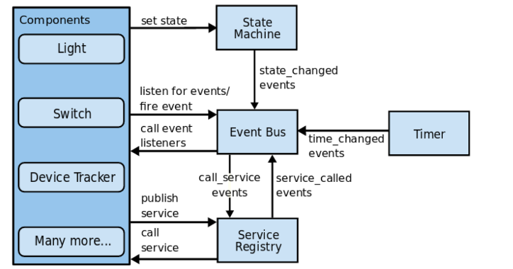

<td style="width: 20%;"></td>

<strong>Home Assistant </strong>

<strong>Prof Epaminondas Lage</strong>

<a href="http://lattes.cnpq.br/7787341723868111"> Currículo Lattes LAGE, E. S.</a> 

# Índice 

* [Sites relacionados ao Home Assistant](Sites-relacionados-ao-Home-Assistant)
* [Introdução](#Introdução)
* [Home Assistant Operating System](#Home-Assistant-Operating-System)
* [Add-on no Home Assistant](#Add-on-no-Home-Assistant)
* [Módulos do Home Assitant](#Módulos-do-Home-Assistant)
* [Home Control](#Home-Control)

# Sites relacionados ao Home Assistant

* https://www.home-assistant.io/
* https://homeassistantbrasil.com.br/

# Introdução

O Home Assistant é uma plataforma de automação residencial descentralizada, gratuita e de código aberto. Ele possibilita o controle de atuadores, interpretação de dados coletados por sensores, implementação de regras de automação e gerenciamento da comunicação entre dispositivos. O Home Assistant pode ser executado em computadores Linux, em SBCs (Single Board Computers) com o sistema operacional dedicado Hass.io, ou em qualquer outro ambiente que possua Python e suas dependências instaladas.

Uma das vantagens distintas do Home Assistant é sua capacidade de rodar em SBCs (Single Board Computers), como o Raspberry Pi, aproveitando eficientemente os recursos de hardware disponíveis. Isso permite uma implantação econômica em dispositivos de baixo custo, tornando o Home Assistant uma escolha popular entre os entusiastas da automação residencial.

O Home Assistant oferece várias vantagens, como:

<ul>
<li>Gratuito e de código aberto </li>
<li>Otimizado para rodar em SBCs </li>
<li>Permite a implantação de automações localmente </li>
<li>Fácil instalação </li>
<li>Possui uma interface web interativa para controle </li>
<li>Oferece rollback para versões antigas </li>
<li> É escalável, permitindo trabalhar com add-ons </li>
</ul>

O Home Assistant é projetado para operar de forma autônoma e local, sem depender de uma conexão contínua com a nuvem. Isso significa que todas as automações e regras são executadas diretamente no dispositivo, proporcionando maior privacidade, segurança e desempenho. A instalação do Home Assistant é simplificada e flexível, com opções como o Hass.io, um sistema operacional otimizado para o Home Assistant, que facilita a configuração e o gerenciamento do sistema.

# Instalação 

Para instalar o Home Assistant, é recomendado um sistema dedicado como um Raspberry Pi, Mini PC, Notebook ou até mesmo um PC velhinho que está encostado. Caso você não tenha um hardware dedicado, é possível instalar em uma maquina virtual (VM) em sua máquina com Windows, Linux ou MacOS.

Existem 4 formas de instalar o Home Assistant:
<UL>
   <Li>HassOS – Home Assistant Operational System (Sistema Operacional do Home Assistant): Um sistema operacional Linux otimizado para a execução do Home Assistant. Ele conta com o Supervisor para gerenciar o núcleo do Home Assistant e seus add-ons.</Li>
    <Li>Home Assistant Container: Instalação do Home Assistant em sistema operacional Linux baseada em containers (Por exemplo, Docker).</Li>
    <Li>Home Assistant Supervised: Instalação manual do Home Assistant com suporte ao supervisor para a instalação de add-ons. Esse método deve ser executado em uma instalação de Debian Linux e é o preferido de quem utiliza o mesmo hardware para executar outras tarefas, por exemplo Plex Media Server, entre outros…</Li>
 <Li>Home Assistant Core: Instalação do núcleo do Home Assistant em sistema operacional Linux usando ambiente virtual Python.</Li>
</UL>

# Integrações

Na data de 15 de julho de 2023 ,no site do home hassitant existem 2450 integraçoes possíves. Entertanto esta número cresce diariamente e ainda existem as integração fornecidas pela comunidade. Vale uma visita: https://www.home-assistant.io/integrations/#all 

# Home Assistant Operating System

Para facilitar a instalação e utilização do Home Assistant, foi desenvolvido o Hass.io, um sistema operacional customizado e configurado para executar o Home Assistant. O Home Assistant é gerenciado por um supervisor que roda dentro de um container Docker, o qual, por sua vez, é executado por um sistema operacional desenvolvido especificamente para SBCs. O supervisor possui uma API que gerencia os processos do Home Assistant e também é responsável por realizar atualizações do sistema.

O Home Assistant Operating System oferece um ambiente estável e seguro para executar o Home Assistant, garantindo uma experiência confiável para o usuário. Além disso, a integração do Docker simplifica a implantação e o gerenciamento do Home Assistant e de seus complementos, permitindo atualizações fáceis e aprimoramentos contínuos do sistema.

Para instalar o Home Assistant Operating System, o usuário precisa baixar a imagem apropriada para seu dispositivo e plataforma no site oficial do Home Assistant. Essa imagem é então gravada em um meio de armazenamento, como um cartão SD ou um dispositivo USB, e inserida no dispositivo alvo. Ao inicializar, o dispositivo carrega o Home Assistant Operating System e inicia o processo de instalação.

Uma vez instalado, o Home Assistant Operating System fornece uma interface de usuário baseada na web para configurar e personalizar a automação residencial. O Supervisor, uma parte integral do Home Assistant Operating System, gerencia o Home Assistant Core e os complementos, fornecendo uma camada adicional de facilidade de uso e controle.

O Home Assistant Operating System é o método de instalação recomendado para a maioria dos usuários. Trata-se de um sistema operacional Linux otimizado para hospedar o Home Assistant e seus complementos. O Home Assistant Operating System utiliza o Docker como motor de contêiner, o que proporciona uma execução eficiente e isolada do Home Assistant e de suas dependências.

Em resumo, o Home Assistant Operating System é a escolha recomendada para a instalação do Home Assistant, proporcionando um ambiente otimizado, seguro e de fácil gerenciamento para a automação residencial.

Figura 1: Arquitetura Hass.io

# Add-on no Home Assistant

O Home Assistant oferece um recurso chamado add-ons, que permite adicionar funcionalidades extras ao sistema. Os add-ons são módulos de software adicionais que podem ser instalados no Home Assistant para estender suas capacidades. Eles fornecem recursos adicionais, como integração com serviços de terceiros, suporte a dispositivos específicos e ferramentas de automação avançadas.

Os add-ons são gerenciados pelo Supervisor, que faz parte do Home Assistant Operating System. O Supervisor oferece uma interface de gerenciamento fácil de usar para instalar, configurar e atualizar os add-ons.

Você pode explorar e instalar novos add-ons diretamente na interface do usuário do Home Assistant. Existem muitos add-ons disponíveis na loja oficial de add-ons do Home Assistant, além de contribuições de comunidades e desenvolvedores externos.

Os add-ons do Home Assistant são empacotados como contêineres Docker, o que facilita sua instalação e isolamento do sistema principal. Eles são executados em paralelo com o Home Assistant Core, permitindo expandir as funcionalidades do sistema sem interferir em sua operação principal.

Com os add-ons, você pode personalizar e aprimorar seu sistema Home Assistant de acordo com suas necessidades específicas, adicionando recursos e integrações com outros serviços e dispositivos.

Figura 2: Loja de Add-ons do HA

A loja de add-ons do Home Assistant inclui componentes de terceiros disponibilizados no GitHub, bem como add-ons oficiais que oferecem diversas funcionalidades, como MQTT Home Broker, servidor DNS (Domain Name System), servidor de arquivos, servidor SSH (Secure Shell), entre outros. Essa combinação de Home Assistant com a capacidade de adicionar funcionalidades por meio de add-ons impulsiona a escalabilidade e a capacidade de personalização da plataforma.

# Módulos do Home Assistant

O Home Assistant possui uma arquitetura composta por cinco módulos principais, cada um desempenhando um papel específico no sistema. Esses módulos são:
<ol>
<li>Home Control: O módulo Home Control é responsável por coletar informações e controlar os atuadores do sistema. Ele permite monitorar e interagir com dispositivos conectados, como interruptores, sensores de movimento, câmeras, termostatos e muito mais. O Home Control fornece uma interface unificada para visualizar e controlar esses dispositivos.</li>
<li>User Management: O módulo User Management lida com a gestão de usuários no sistema Home Assistant. Ele permite criar contas de usuário, definir permissões e controlar o acesso aos recursos e configurações do sistema. O User Management garante que cada usuário tenha sua própria experiência personalizada e níveis apropriados de controle e acesso.</li>
<li>Home Automation: O módulo Home Automation é responsável por acionar comandos e ações com base nas configurações fornecidas pelos usuários. Ele permite criar regras e automações personalizadas para controlar os dispositivos conectados. Por exemplo, é possível configurar uma automação para ligar as luzes quando um sensor de movimento for acionado ou ajustar a temperatura do termostato com base em horários específicos.</li>
<li>Smart Home: O módulo Smart Home aciona comandos e ações com base nos estados de outros atuadores e sensores no sistema. Ele permite criar cenários e interações mais avançadas entre os dispositivos. Por exemplo, o Smart Home pode acionar o desligamento automático de dispositivos quando não há ninguém em casa ou ativar o sistema de segurança quando um sensor de porta for aberto.</li>
<li>Internet of Things (IoT): O módulo Internet of Things (IoT) representa os atuadores e sensores físicos em si. Esses dispositivos conectados são responsáveis por coletar informações ambientais, como temperatura, umidade, presença, luminosidade, entre outros, e também executam ações físicas, como ligar/desligar luzes, controlar persianas, ativar eletrodomésticos, entre outros. O Home Assistant fornece suporte a uma ampla gama de dispositivos IoT populares, permitindo a integração perfeita com eles.</li>
</ol>

Figura 3: Módulos do Home Assistant

Essa arquitetura modular do Home Assistant permite uma abordagem flexível e personalizável para controlar e automatizar uma casa inteligente. Os diferentes módulos trabalham em conjunto para fornecer uma experiência de automação residencial completa e abrangente.

# Home Control

Para uma melhor compreensão do funcionamento do Home Assistant, é importante definir os conceitos de evento, ação e serviço. Esses conceitos desempenham papéis fundamentais no sistema:

<ol>
<li>Evento: É um acontecimento observável pelo sistema que pode ou não alterar o estado de um atuador ou sensor. Representa uma mudança de estado ou interação detectada pelo sistema.</li>
<li>Ação: É um evento que é acionado quando todas as suas condições necessárias são satisfeitas. Quando essas condições são atendidas, a ação correspondente é executada. As ações desencadeiam uma resposta do sistema, como acionar um atuador ou executar uma função específica.</li>
<li>Serviço: São métodos executados pelo Home Assistant para realizar ações específicas. Representam funcionalidades e comandos disponíveis no sistema, como ligar/desligar uma luz, ajustar a temperatura de um termostato ou reproduzir música.</li>
</ol>

Para uma melhor compreensão do funcionamento do Home Assistant, é importante definir os conceitos de evento, ação e serviço. Esses conceitos desempenham papéis fundamentais no sistema. 

Ao analisar o módulo Home Control mais detalhadamente, podemos dividi-lo em quatro componentes principais:

<ol> 
<li>Event Bus (Barramento de Eventos): Responsável por escutar e disparar eventos para os atuadores, mantendo a sincronia do sistema com o mundo real. Quando é necessário alterar o estado de um atuador ou sensor, o Event Bus dispara as ações correspondentes.</li>
<li>State Machine (Máquina de Estados): Mantém um registro de todos os estados dos atuadores e comunica ao Event Bus quando algum estado é alterado. Monitora as mudanças de estado e notifica o Event Bus, permitindo o acionamento das ações de acordo com essas alterações.</li>
<li>Service Registry (Registro de Serviços): Realiza a chamada dos serviços que, por sua vez, executam as ações nos atuadores. Gerencia e controla a execução dos serviços, responsáveis por manipular os atuadores conforme necessário.</li>
<li>Timer (Temporizador): Responsável por atualizar a hora no Event Bus, emitindo um evento de mudança de tempo a cada segundo para o Home Control. Esse evento é importante para sincronizar ações programadas ou baseadas em horários específicos.</li>
</ol>

Figura 4: Core Arquiteture - Home Assistant

Esses módulos trabalham em conjunto para permitir que o Home Assistant detecte eventos, verifique suas condições e acione as ações correspondentes nos atuadores. Essa estrutura modular garante um controle eficiente e responsivo do sistema, permitindo automação e interação com os dispositivos conectados.

O Home Assistant possui a capacidade de se comunicar com uma ampla variedade de dispositivos inteligentes para automação, mesmo que eles utilizem diferentes protocolos e padrões de comunicação. Para possibilitar essa comunicação e permitir a integração dos dispositivos, o Home Assistant adota uma abordagem de tratamento e gerenciamento dos dispositivos.

Pode-se observar que, para estabelecer a comunicação com o Home Assistant, são necessários os atuadores e sensores, representados pelo Light Bulb (lâmpada) e Motion Detector (sensor de movimento), respectivamente. Além disso, é necessário contar com uma camada de software que confere inteligência aos atuadores e sensores, como o Hue Platform e o Z-Wave Platform, os quais são executados diretamente pelos dispositivos.

Por parte do Home Assistant, é necessário contar com uma camada de software responsável por implementar os protocolos utilizados pelos atuadores e sensores, seguindo as mesmas regras e padrões de comunicação estabelecidos por eles. Essa camada de software é representada pelo Light Component.

Uma vez que os sensores e atuadores estão adaptados e integrados ao Home Assistant, é necessário representar cada instância desses dispositivos para que possam ser manipulados utilizando os conceitos de evento, ação e serviço. Essa camada de representação das instâncias dos dispositivos é denominada Entities.

Dessa forma, o Home Assistant permite que os dispositivos sejam interconectados e controlados de forma inteligente, utilizando eventos, ações e serviços, proporcionando uma integração fluida e permitindo a automação de tarefas e a interação entre os diferentes dispositivos em um ambiente de automação residencial.

Figura 5: Componentes(atuadores/sensores) Home Assistant

No Home Assistant, é necessário adicionar uma camada de software para se comunicar com os protocolos e padrões dos atuadores. Esses softwares podem ser adicionados ao Home Assistant por meio de add-ons baixados na loja virtual do sistema. Após configurar todas as dependências necessárias, é hora de realizar a configuração de automações e a instanciação de atuadores e sensores, quando eles não forem identificados automaticamente.

Existem dois arquivos principais de configuração no Home Assistant:
<ol>
	<li>settings.yaml: Neste arquivo, especificamos as instâncias de todas as entidades do sistema. Aqui, definimos as configurações para cada atuador e sensor presente no ambiente.</li>
	<li>automations.yaml: Neste arquivo, definimos os padrões de comportamento, também conhecidos como automações, para as entidades do sistema. Aqui, podemos criar regras e cenários para automatizar tarefas e acionar ações com base em eventos e condições específicas.</li>
</ol>

Embora utilizemos o formato YAML, projetado para serializar dados de forma legível para humanos, configurar as automações e as configurações do sistema ainda pode ser um processo complexo. Para tornar esse processo mais intuitivo e ágil, o Home Assistant introduziu uma interface web que apresenta de maneira clara e simples todas as entidades e sensores disponíveis no sistema.

Ao utilizar o editor de automações na interface web, precisamos definir quatro parâmetros essenciais para configurar uma automação:

<ol>
<li>Nome: Damos um nome descritivo para a automação, que nos ajuda a identificá-la facilmente.</li>
<li> Gatilhos: Especificamos os eventos ou condições que devem acionar a automação. Por exemplo, um gatilho pode ser o acionamento de um sensor de movimento ou o horário do dia.</li>
<li>Condições: Definimos as condições adicionais que devem ser atendidas para que a automação seja executada. Por exemplo, podemos exigir que uma luz esteja ligada antes de acionar uma ação relacionada.</li>
<li>Ações: Determinamos as ações que devem ser executadas quando a automação é acionada. Isso pode incluir ligar ou desligar dispositivos, enviar notificações, reproduzir sons, entre outras possibilidades.</li>
</ol>

Figura 6: Tela de menu de configurações do Home Assistant

Através desse processo de configuração, podemos personalizar e adaptar o Home Assistant de acordo com nossas necessidades e criar automações que tornam a experiência de automação residencial mais conveniente e eficiente.

Figura 7: Arquivos YAML de configuração do HA

&nbsp;

# Status do Projeto

